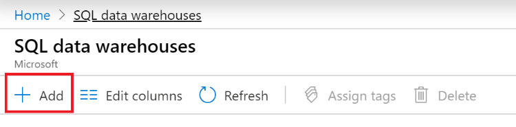

##  Task 1: Download Sample Data

1. Navigate to: [Sample Data](https://github.com/matthewrodin/AzureAnalysisServices-SlidingWindowPartitioning/tree/master/Sample%20Data)

2. Download “SampleCustomerData.csv” and “SampleSalesData.csv” to a local machine

##  Task 2: Create Azure SQL Database

1. Navigate to: [Azure Portal](https://portal.azure.com/)

2. In the search bar, type “sql” and select “SQL data warehouses
 

3. On the top left, click “+ Add”
  

	a.	Under “Subscription” -> Select existing Azure subscription

	b.	Under “Resource group” -> Click “Create New” -> Enter a name for the resource group

	c.	Under “Data Warehouse name” -> Enter a name for the data warehouse

Deployment may take up to 20 minutes.

##  Task 3: Prepare SQL Data Warehouse for Data Ingestion
1. Open command prompt
2. Run the following command:
`sqlcmd -S <servername> -d <databasename> -U <serverusername> -P <serverpassword> -I`
**Note:** You can find the <servername> in the “Overview” window of your SQL Data Warehouse resource in the Azure portal.
3. If the following error is received: *“Sqlcmd: Error: Microsoft ODBC Driver 17 for SQL Server : Cannot open server…”*

	a.	Copy the IP address provided in the error message

	b.	Navigate to portal.azure.com

	c.	In the search bar, type “sql server” and select “SQL servers”

