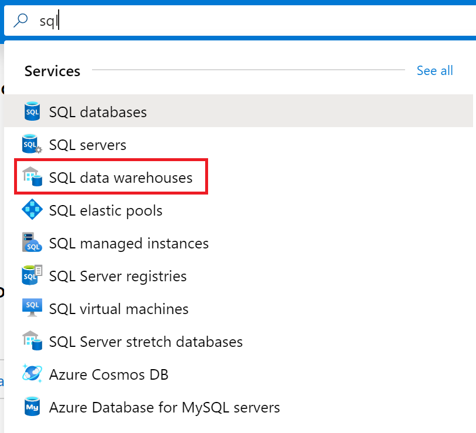

##  Task 1: Download Sample Data


1.  Navigate to: [Sample Data](https://github.com/matthewrodin/AzureAnalysisServices-SlidingWindowPartitioning/tree/master/Sample%20Data)

2.  Download “SampleCustomerData.csv” and “SampleSalesData.csv” to a local machine
</br>

##  Task 2: Create Azure SQL Database

1.  Navigate to: [Azure Portal](https://portal.azure.com/)

2.  In the search bar, type “sql” and select “SQL data warehouses
</br>

3.  On the top left, click “+ Add”
</br>

    a.  Under “Subscription” -> Select existing Azure subscription 
    
    b.  Under “Resource group” -> Click “Create New” -> Enter a name for the resource group
    
    c.  Under “Data Warehouse name” -> Enter a name for the data warehouse
    
    d.  Under “Server” -> Click “Create New” 
    
        i.   Under “Server Name” -> Enter a unique name for the server
        
        ii.  Under “Server Admin Login” -> Create a username for the server
        
        iii. Under “Password” -> Create a password for the server

		iv.  Under “Location” -> Select “Canada Central”

		v.   Tick “Allow Azure services to access server”

		vi.  Click “OK”

	e. Under “Performance Level”, select “Select performance level”

		i.   Click “Gen2”

		ii.  Scale the data warehouse. For reference, the service levels range from DW100c to DW30000c. 

		iii. Click “Apply”
        
    f. On the bottom left, click the blue “Review + Create” button
    
    g.  On the bottom left, click the blue “Create” button
    
</br>
Deployment may take up to 20 minutes.
</br>
</br>

##  Task 3: Prepare SQL Data Warehouse for Data Ingestion
1. Open command prompt


2. Run the following command:
`sqlcmd -S <servername> -d <databasename> -U <serverusername> -P <serverpassword> -I`
**Note:** You can find the <servername> in the “Overview” window of your SQL Data Warehouse resource in the Azure portal.
3. If the following error is received: *“Sqlcmd: Error: Microsoft ODBC Driver 17 for SQL Server : Cannot open server…”*
    
	a.	Copy the IP address provided in the error message

	b.	Navigate to portal.azure.com

	c.	In the search bar, type “sql server” and select “SQL servers”
    
    </br>

	d.	Select the server created in Task 2

	e.	Select “Firewalls and virtual networks”
    </br>
    
        i.   Under “Allow Azure services and resources to access this server” -> Click “On”
        
        ii.  Under Rule Name -> “Rule1”
        
        iii. Under Start IP -> Paste the copied IP Address
        
        iv.  Under End IP -> Paste the copied IP Address
        
        </br>
    
    f.	Click “Save”

4.	“1>” should now appear.

5.	Run the following script:
    ```sql
    CREATE TABLE [dbo].[DimCustomer](
        [CustomerKey] [int] NOT NULL,
        [AddressLine1] [varchar](500) NULL,
        [CommuteDistance] [varchar](500) NULL,
        [EmailAddress] [varchar](500) NULL,
        [FirstName] [varchar](500) NULL,
        [LastName] [varchar](500) NULL,
        [Gender] [varchar](500) NULL,
        [Phone] [varchar](500) NULL,
        [YearlyIncome] [varchar](500) NULL,
        [MaritalStatus] [varchar](500) NULL,
        [GeographyKey] [int] NULL,
        [EnglishEducation] [varchar](500) NULL,
        [EnglishOccupation] [varchar](500) NULL,
        [TotalChildren] [int] NULL);
    GO

    ```

6.	Run the following script:
    
    ```sql
    CREATE TABLE [dbo].[FactSales](
        [CustomerKey] [int] NOT NULL,
        [ProductKey] [int] NOT NULL,
        [OrderDateKey] [varchar](500) NOT NULL,
        [CurrencyKey] [int] NOT NULL,
        [SalesOrderNumber] [varchar](500) NOT NULL,
        [SalesTerritoryKey] [int] NOT NULL,
        [TaxAmt] [varchar](500) NOT NULL,
        [Freight] [varchar](500) NOT NULL,
        [SalesAmount] [varchar](500) NOT NULL,
        [Year] [int] NOT NULL,
        [Month] [int] NOT NULL,
        [Day] [int] NOT NULL)
    GO

    ```

</br>

##  Task 4: Create a Storage Account

1.	Navigate to portal.azure.com

2.	In the search bar, type “storage” and select “Storage accounts”


    


