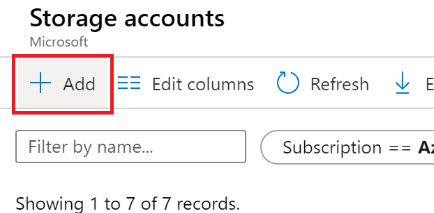
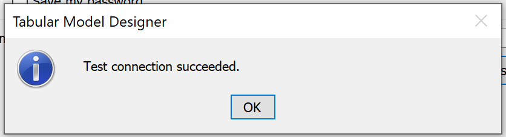

##  Task 1: Download Sample Data


1.  Navigate to: [Sample Data](https://github.com/matthewrodin/AzureAnalysisServices-SlidingWindowPartitioning/tree/master/Sample%20Data)

2.  Download “SampleCustomerData.csv” and “SampleSalesData.csv” to a local machine
</br>

##  Task 2: Create Azure SQL Database

1.  Navigate to: [Azure Portal](https://portal.azure.com/)

2.  In the search bar, type “sql” and select “SQL data warehouses
</br>

3.  On the top left, click “+ Add”
</br>

    a.  Under “Subscription” -> Select existing Azure subscription 
    
    b.  Under “Resource group” -> Click “Create New” -> Enter a name for the resource group
    
    c.  Under “Data Warehouse name” -> Enter a name for the data warehouse
    
    d.  Under “Server” -> Click “Create New” 
    
        i.   Under “Server Name” -> Enter a unique name for the server
        
        ii.  Under “Server Admin Login” -> Create a username for the server
        
        iii. Under “Password” -> Create a password for the server

		iv.  Under “Location” -> Select “Canada Central”

		v.   Tick “Allow Azure services to access server”

		vi.  Click “OK”

	e. Under “Performance Level”, select “Select performance level”

		i.   Click “Gen2”

		ii.  Scale the data warehouse. For reference, the service levels range from DW100c to DW30000c. 

		iii. Click “Apply”
        
    f. On the bottom left, click the blue “Review + Create” button
    
    g.  On the bottom left, click the blue “Create” button
    
</br>
Deployment may take up to 20 minutes.
</br>
</br>

##  Task 3: Prepare SQL Data Warehouse for Data Ingestion
1. Open **Command Prompt**


2. Run the following command:
`sqlcmd -S <servername> -d <databasename> -U <serverusername> -P <serverpassword> -I`
**Note:** You can find the <servername> in the “Overview” window of your SQL Data Warehouse resource in the Azure portal.
3. If the following error is received: *“Sqlcmd: Error: Microsoft ODBC Driver 17 for SQL Server : Cannot open server…”*
    
	a.	Copy the IP address provided in the error message

	b.	Navigate to portal.azure.com

	c.	In the search bar, type “sql server” and select “SQL servers”
    </br>

	d.	Select the server created in Task 2

	e.	Select “Firewalls and virtual networks”
    </br>
    
        i.   Under “Allow Azure services and resources to access this server” -> Click “On”
        
        ii.  Under Rule Name -> “Rule1”
        
        iii. Under Start IP -> Paste the copied IP Address
        
        iv.  Under End IP -> Paste the copied IP Address
    </br>
    
    f.	Click “Save”

4.	“1>” should now appear.

5.	Run the following script:
    ```sql
    CREATE TABLE [dbo].[DimCustomer](
        [CustomerKey] [int] NOT NULL,
        [AddressLine1] [varchar](500) NULL,
        [CommuteDistance] [varchar](500) NULL,
        [EmailAddress] [varchar](500) NULL,
        [FirstName] [varchar](500) NULL,
        [LastName] [varchar](500) NULL,
        [Gender] [varchar](500) NULL,
        [Phone] [varchar](500) NULL,
        [YearlyIncome] [varchar](500) NULL,
        [MaritalStatus] [varchar](500) NULL,
        [GeographyKey] [int] NULL,
        [EnglishEducation] [varchar](500) NULL,
        [EnglishOccupation] [varchar](500) NULL,
        [TotalChildren] [int] NULL);
    GO

    ```

6.	Run the following script:
    
    ```sql
    CREATE TABLE [dbo].[FactSales](
        [CustomerKey] [int] NOT NULL,
        [ProductKey] [int] NOT NULL,
        [OrderDateKey] [varchar](500) NOT NULL,
        [CurrencyKey] [int] NOT NULL,
        [SalesOrderNumber] [varchar](500) NOT NULL,
        [SalesTerritoryKey] [int] NOT NULL,
        [TaxAmt] [varchar](500) NOT NULL,
        [Freight] [varchar](500) NOT NULL,
        [SalesAmount] [varchar](500) NOT NULL,
        [Year] [int] NOT NULL,
        [Month] [int] NOT NULL,
        [Day] [int] NOT NULL)
    GO

    ```

</br>

##  Task 4: Create a Storage Account

1.	Navigate to [Azure Portal](https://portal.azure.com/)

2.	In the search bar, type “storage” and select “Storage accounts”
</br>

3.	Click “+ Add”
</br>

    a.	Under “Subscription” -> Select existing Azure subscription
    
    b.	Under “Resource group” Select the resource group created in Task 2
    
    c.	Under “Storage account name” -> Enter a name for the storage account
    
    d.	Under “Location” -> Select “Canada Central”
    
    e.	Under “Performance” -> Select “Standard”

    f.	Under “Account kind” -> Select “StorageV2 (general purpose v2)”

    g.	Under “Replication” -> Select “Locally-redundant storage (LRS)”
    
    h.	Under “Access tier (default)” -> Select “Cool”
    
    i.	On the bottom left, click the blue “Review + Create” button
    
    j.	On the bottom left, click the blue “Create” button
    
</br>Deployment may take a minute.</br>


4.	Click “Go to Resource”

5.	Under “Blob service” -> Click “Containers”
</br>

6.	Click “+ Container”
</br>

    a.	Under “Name” -> Enter a name for the container
    
    b.	Under “Public access level” -> Select “Blob (anonymous read access for blobs only)”
    
7.	Select “Storage Explorer”
</br>

8.	Click on “BLOB CONTAINERS”
</br>

9.	Click on the container that was just created

10.	Click “Upload”
</br>

11.	Click the blue browse button and upload the local copies of “SampleCustomerData.csv” and “SampleSalesData.csv” to the container. 

12.	Leave “Overwrite if files already exist” blank
</br>

</br>

##  Task 5: Create a Data Factory

1.	Navigate to [Azure Portal](https://portal.azure.com/)

2.	In the search bar, type “data factory” and select “SQL data warehouses”
</br>

3.	Click “+ Add”
</br>

    a.	Under “Name” -> Enter a name for the data factory
    
    b.	Under “Version” -> Select “V2”
    
    c.	Under Subscription” -> Select existing Azure subscription
    
    d.	Under “Resource Group” -> Select the resource group created in Task 2
    
    e.	Under “Location” -> Select “Canada Central”
    
    f.	Untick “Enable Git”
    
    g.	Click “Create”

</br>

##  Task 6: Create a Data Factory Pipeline

1.	Navigate to [Azure Data Factory](https://adf.azure.com/)

2.	Under “Azure Active Directory” -> Select existing Azure AD

3.	Under “Subscription” -> Select existing Azure subscription

4.	Under Data Factory name -> Select the Data Factory created in Task 5

5.	Click “Continue”

6.	Click the Home icon
</br>

7.	Click “Copy data”
</br>

8.	Under “Properties”

    a.	Under “Task Name” -> Enter a name for the task
    
    b.	Under “Task cadence or task schedule” -> Select “Run once now”
    
    c.	Click “Next”
    
9.	Under “Source”

    a.	Select “Azure”
    
    b.	Select “+ Create new connection”
    </br>
    
    c.	Select “Azure Blob Storage”
    
    d.	Click “Continue
    </br>
    
    e.	Under “Name” -> Enter a name for the connection
    
        i.   Under “Account selection method” -> Select “From Azure Subscription”
        
        ii.  Under “Azure subscription” -> Select existing Azure subscription
        
        iii. Under “Storage account name” -> Select the storage account created in Task 4
        
        iv.  **Note:** Leave all other fields as the default
        
        v.   Click “Create”
        
    f.	Click “Next”
    
    g.	Under “File or folder” -> Click “Browse”
    
    h.	Double click the container you created in Task 4
    
    i.	Select “SampleCustomerData.csv”
    
    j.	Click “Choose”
    
    k.	Note: Keep all other fields as the default
    
    l.	Click “Next”
    
    m.	Verify the schema under “Preview” and click “Next”

10.	Under “Destination”

    a.	Click “Azure”

    b.	Click “Create new connection”
    
    c.	Select “Azure Synapse Analytics (formerly SQL DW)”

    d.	Click “Continue”
    </br>
    
    e.	Under “Name” -> Enter a name for the connection
    
        i.    Under “Account selection method” -> Select “From Azure Subscription”
        
        ii.	  Under “Azure subscription” -> Select existing Azure subscription
        
        iii.  Under “Server name” -> Select the server created in Step 2
        
        iv.	  Under “Database name” -> Select the storage account created in Step 4
        
        v.	  Under “Authentication type” -> Select “SQL authentication”
        
        vi.   Under “User name” -> Enter the username of the server created in Task 2
        
        vii.  Under “Password -> Enter the username of the server created in Task 2
        
        viii. **Note:** Leave all other fields as the default
        
        ix.	Click “Create”
        
    f.	Click “Next”
    
    g.	In the dropdown, select “dbo.DimCustomer”
    </br>
    
    h.	Click “Next”
    
    i.	Alter the source types in order to match the destination. The column mapping should look like this:
    </br>
    
    j.	Click “Next”
    
11.	Under “Settings”

    a.	Under “Staging account linked service” -> Select the connection created in Task 6 (Step 9e)
    
    b.	Click “Next”

12.	Under “Summary”, verify the summary appropriately summarizes the intended pipeline and click “Next”

13.	Under “Deployment”, verify that the deployment was successful and click “Finish”


Repeat Steps 1 to 13 of Task 6 for “SampleSalesData.csv”.

* In Step 10g, select “dbo.FactSales”

* In Step 10i, the mapping should match the following:
</br>

</br>

##  Task 7: Verify Data Ingestion

1.	Open **Microsoft SQL Server Management Studio**

    For more information about SSMS or to download, visit: [SSMS](https://docs.microsoft.com/en-us/sql/ssms/download-sql-server-management-studio-ssms?view=sql-server-ver15)

2.	Click “Connect” -> “Database Engine…”
</br>

    a.	Under “Server name” -> Enter the server name of server created in Task 2
    
    b.	Under “Authentication” -> Select “SQL Server Authentication”
    
    c.	Under “Login” -> Enter the username of the server created in Task 2
    
    d.	Under “Password” -> Enter the password of the server created in Task 2.
    
    e.	Click “Connect”
    
In the “Object Explorer” pane, under 

*ServerName.database.windows.net -> "Databases" -> SQLDataWarehouseName -> "Tables"*

the two tables created in Task 3 should appear.

</br>

3.	Right click one of the two tables and click “Select Top 100 Rows”.

Under “Results”, data should now be populated in the selected table from the CSV file.

4.	Repeat Step 8 for the other table

</br>

##  Task 8: Create Data Model

**Part 1:** Create Visual Studio Project

1.	Open **Microsoft Visual Studio**

For more information about VS or to download, visit: [Visual Studio](https://docs.microsoft.com/en-us/visualstudio/install/install-visual-studio?view=vs-2019) 

2.	Click “Create a new project”
</br>

3.	Select “Analysis Services Tabular Project” and click “Next”
</br> 

    If this does not show up in the list of templates, scroll to the bottom and click “Install more tools and features”
    </br> 

    a.	Inside Visual Studio Installer, click “Individual components”

    b.	Select the following:

        i.   Microsoft Analysis Services Projects
    
        ii.  Microsoft BI Shared Components for Visual Studio

        iii. Microsoft.VisualStudio.Tools.Application

        iv.  SQL Server Integration Services Projects
    </br> 

    c.	Click “Modify” on the bottom right.

5.	Under “Project name” -> Enter a name for the VS project

6.	Keep all other settings as default and click “Create”

7.	Under “Select an Analysis Services instance to use while authoring projects” -> Select “Integrated workspace”

8.	Under “Compatibility level” -> Select “SQL Server 2016 RTM (1200)

9.	Click “Ok”
</br>
**Part 2:** Import Data in Visual Studio

1.	Once the workspace is set up, select “Import from Data Source”
</br> 

2.	Select “Microsoft Azure SQL Data Warehouse” and click “Next”
</br> 

3.	Important: Do not modify “Friendly connection name”

4.	Under “Server name” -> Enter the name of the server created in Task 2

5.	Under “User name” -> Enter the username of the server created in Task 2

6.	Under “Password” -> Enter the password of the server created in Task 2

7.	Click “Test Connection” and ensure that the following message is received:
</br> 

8.	Under “Database Name” -> Select the database created in Task 2, Step 5

9.	Click “Next”

10.	Tick “Service Account”

11.	Click “Next”

12.	Tick “Select from a list of tables and views to choose the data to import”

13.	Click “Next”

14.	Tick “DimCustomer” and “FactSales”

15.	Click “Finish”

16.	Click “Close”
</br>
**Part 3:** Create Model in Visual Studio

1.	Click the “Diagram” button


    


