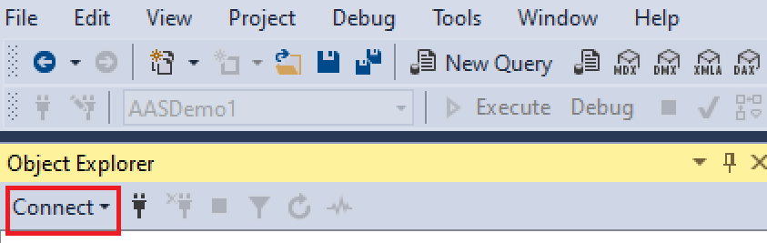
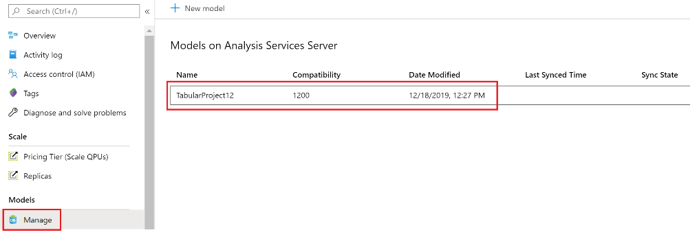
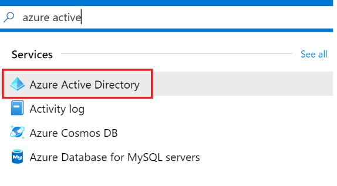

##  Task 1: Download Sample Data


1.  Navigate to: [Sample Data](https://github.com/matthewrodin/AzureAnalysisServices-SlidingWindowPartitioning/tree/master/Sample%20Data)

2.  Download “SampleCustomerData.csv” and “SampleSalesData.csv” to a local machine
</br>

##  Task 2: Create Azure SQL Database

1.  Navigate to: [Azure Portal](https://portal.azure.com/)

2.  In the search bar, type “sql” and select “SQL data warehouses
</br>

3.  On the top left, click “+ Add”
</br>

    a.  Under “Subscription” -> Select existing Azure subscription 
    
    b.  Under “Resource group” -> Click “Create New” -> Enter a name for the resource group
    
    c.  Under “Data Warehouse name” -> Enter a name for the data warehouse
    
    d.  Under “Server” -> Click “Create New” 
    
        i.   Under “Server Name” -> Enter a unique name for the server
        
        ii.  Under “Server Admin Login” -> Create a username for the server
        
        iii. Under “Password” -> Create a password for the server

		iv.  Under “Location” -> Select “Canada Central”

		v.   Tick “Allow Azure services to access server”

		vi.  Click “OK”

	e. Under “Performance Level”, select “Select performance level”

		i.   Click “Gen2”

		ii.  Scale the data warehouse. For reference, the service levels range from DW100c to DW30000c. 

		iii. Click “Apply”
        
    f. On the bottom left, click the blue “Review + Create” button
    
    g.  On the bottom left, click the blue “Create” button
    
</br>
Deployment may take up to 20 minutes.
</br>
</br>

##  Task 3: Prepare SQL Data Warehouse for Data Ingestion
1. Open **Command Prompt**


2. Run the following command:
`sqlcmd -S <servername> -d <databasename> -U <serverusername> -P <serverpassword> -I`
**Note:** You can find the <servername> in the “Overview” window of your SQL Data Warehouse resource in the Azure portal.
3. If the following error is received: *“Sqlcmd: Error: Microsoft ODBC Driver 17 for SQL Server : Cannot open server…”*
    
	a.	Copy the IP address provided in the error message

	b.	Navigate to portal.azure.com

	c.	In the search bar, type “sql server” and select “SQL servers”
    </br>

	d.	Select the server created in Task 2

	e.	Select “Firewalls and virtual networks”
    </br>
    
        i.   Under “Allow Azure services and resources to access this server” -> Click “On”
        
        ii.  Under Rule Name -> “Rule1”
        
        iii. Under Start IP -> Paste the copied IP Address
        
        iv.  Under End IP -> Paste the copied IP Address
    </br>
    
    f.	Click “Save”

4.	“1>” should now appear.

5.	Run the following script:
    ```sql
    CREATE TABLE [dbo].[DimCustomer](
        [CustomerKey] [int] NOT NULL,
        [AddressLine1] [varchar](500) NULL,
        [CommuteDistance] [varchar](500) NULL,
        [EmailAddress] [varchar](500) NULL,
        [FirstName] [varchar](500) NULL,
        [LastName] [varchar](500) NULL,
        [Gender] [varchar](500) NULL,
        [Phone] [varchar](500) NULL,
        [YearlyIncome] [varchar](500) NULL,
        [MaritalStatus] [varchar](500) NULL,
        [GeographyKey] [int] NULL,
        [EnglishEducation] [varchar](500) NULL,
        [EnglishOccupation] [varchar](500) NULL,
        [TotalChildren] [int] NULL);
    GO

    ```

6.	Run the following script:
    
    ```sql
    CREATE TABLE [dbo].[FactSales](
        [CustomerKey] [int] NOT NULL,
        [ProductKey] [int] NOT NULL,
        [OrderDateKey] [varchar](500) NOT NULL,
        [CurrencyKey] [int] NOT NULL,
        [SalesOrderNumber] [varchar](500) NOT NULL,
        [SalesTerritoryKey] [int] NOT NULL,
        [TaxAmt] [varchar](500) NOT NULL,
        [Freight] [varchar](500) NOT NULL,
        [SalesAmount] [varchar](500) NOT NULL,
        [Year] [int] NOT NULL,
        [Month] [int] NOT NULL,
        [Day] [int] NOT NULL)
    GO

    ```

</br>

##  Task 4: Create a Storage Account

1.	Navigate to [Azure Portal](https://portal.azure.com/)

2.	In the search bar, type “storage” and select “Storage accounts”
</br>

3.	Click “+ Add”
</br>

    a.	Under “Subscription” -> Select existing Azure subscription
    
    b.	Under “Resource group” Select the resource group created in Task 2
    
    c.	Under “Storage account name” -> Enter a name for the storage account
    
    d.	Under “Location” -> Select “Canada Central”
    
    e.	Under “Performance” -> Select “Standard”

    f.	Under “Account kind” -> Select “StorageV2 (general purpose v2)”

    g.	Under “Replication” -> Select “Locally-redundant storage (LRS)”
    
    h.	Under “Access tier (default)” -> Select “Cool”
    
    i.	On the bottom left, click the blue “Review + Create” button
    
    j.	On the bottom left, click the blue “Create” button
    
</br>Deployment may take a minute.
</br>
</br>

4.	Click “Go to Resource”

5.	Under “Blob service” -> Click “Containers”
</br>

6.	Click “+ Container”
</br>

    a.	Under “Name” -> Enter a name for the container
    
    b.	Under “Public access level” -> Select “Blob (anonymous read access for blobs only)”
    
7.	Select “Storage Explorer”
</br>

8.	Click on “BLOB CONTAINERS”
</br>

9.	Click on the container that was just created

10.	Click “Upload”
</br>

11.	Click the blue browse button and upload the local copies of “SampleCustomerData.csv” and “SampleSalesData.csv” to the container. 

12.	Leave “Overwrite if files already exist” blank
</br>

</br>

##  Task 5: Create a Data Factory

1.	Navigate to [Azure Portal](https://portal.azure.com/)

2.	In the search bar, type “data factory” and select “SQL data warehouses”
</br>

3.	Click “+ Add”
</br>

    a.	Under “Name” -> Enter a name for the data factory
    
    b.	Under “Version” -> Select “V2”
    
    c.	Under Subscription” -> Select existing Azure subscription
    
    d.	Under “Resource Group” -> Select the resource group created in Task 2
    
    e.	Under “Location” -> Select “Canada Central”
    
    f.	Untick “Enable Git”
    
    g.	Click “Create”

</br>

##  Task 6: Create a Data Factory Pipeline

1.	Navigate to [Azure Data Factory](https://adf.azure.com/)

2.	Under “Azure Active Directory” -> Select existing Azure AD

3.	Under “Subscription” -> Select existing Azure subscription

4.	Under Data Factory name -> Select the Data Factory created in Task 5

5.	Click “Continue”

6.	Click the Home icon
</br>

7.	Click “Copy data”
</br>

8.	Under “Properties”

    a.	Under “Task Name” -> Enter a name for the task
    
    b.	Under “Task cadence or task schedule” -> Select “Run once now”
    
    c.	Click “Next”
    
9.	Under “Source”

    a.	Select “Azure”
    
    b.	Select “+ Create new connection”
    </br>
    
    c.	Select “Azure Blob Storage”
    
    d.	Click “Continue
    </br>
    
    e.	Under “Name” -> Enter a name for the connection
    
        i.   Under “Account selection method” -> Select “From Azure Subscription”
        
        ii.  Under “Azure subscription” -> Select existing Azure subscription
        
        iii. Under “Storage account name” -> Select the storage account created in Task 4
        
        iv.  **Note:** Leave all other fields as the default
        
        v.   Click “Create”
        
    f.	Click “Next”
    
    g.	Under “File or folder” -> Click “Browse”
    
    h.	Double click the container you created in Task 4
    
    i.	Select “SampleCustomerData.csv”
    
    j.	Click “Choose”
    
    k.	Note: Keep all other fields as the default
    
    l.	Click “Next”
    
    m.	Verify the schema under “Preview” and click “Next”

10.	Under “Destination”

    a.	Click “Azure”

    b.	Click “Create new connection”
    
    c.	Select “Azure Synapse Analytics (formerly SQL DW)”

    d.	Click “Continue”
    </br>
    
    e.	Under “Name” -> Enter a name for the connection
    
        i.    Under “Account selection method” -> Select “From Azure Subscription”
        
        ii.   Under “Azure subscription” -> Select existing Azure subscription
        
        iii.  Under “Server name” -> Select the server created in Step 2
        
        iv.   Under “Database name” -> Select the storage account created in Step 4
        
        v.    Under “Authentication type” -> Select “SQL authentication”
        
        vi.   Under “User name” -> Enter the username of the server created in Task 2
        
        vii.  Under “Password -> Enter the username of the server created in Task 2
        
        viii. **Note:** Leave all other fields as the default
        
        ix.   Click “Create”
        
    f.	Click “Next”
    
    g.	In the dropdown, select “dbo.DimCustomer”
    </br>
    
    h.	Click “Next”
    
    i.	Alter the source types in order to match the destination. The column mapping should look like this:
    </br>
    
    j.	Click “Next”
    
11.	Under “Settings”

    a.	Under “Staging account linked service” -> Select the connection created in Task 6 (Step 9e)
    
    b.	Click “Next”

12.	Under “Summary”, verify the summary appropriately summarizes the intended pipeline and click “Next”

13.	Under “Deployment”, verify that the deployment was successful and click “Finish”

</br>
Repeat Steps 1 to 13 of Task 6 for “SampleSalesData.csv”.

* In Step 10g, select “dbo.FactSales”

* In Step 10i, the mapping should match the following:
</br>

</br>

##  Task 7: Verify Data Ingestion

1.	Open **Microsoft SQL Server Management Studio**

    For more information about SSMS or to download, visit: [SSMS](https://docs.microsoft.com/en-us/sql/ssms/download-sql-server-management-studio-ssms?view=sql-server-ver15)

2.	Click “Connect” -> “Database Engine…”
</br>

    a.	Under “Server name” -> Enter the server name of server created in Task 2
    
    b.	Under “Authentication” -> Select “SQL Server Authentication”
    
    c.	Under “Login” -> Enter the username of the server created in Task 2
    
    d.	Under “Password” -> Enter the password of the server created in Task 2.
    
    e.	Click “Connect”

</br>
In the “Object Explorer” pane, under 

*ServerName.database.windows.net -> "Databases" -> SQLDataWarehouseName -> "Tables"*

the two tables created in Task 3 should appear.
</br>

3.	Right click one of the two tables and click “Select Top 100 Rows”. 
    Under “Results”, data should now be populated in the selected table from the CSV file.

4.	Repeat Step 8 for the other table

</br>

##  Task 8: Create Data Model

### Part 1: Create Visual Studio Project

1.	Open **Microsoft Visual Studio**

For more information about VS or to download, visit: [Visual Studio](https://docs.microsoft.com/en-us/visualstudio/install/install-visual-studio?view=vs-2019) 

2.	Click “Create a new project”
</br>

3.	Select “Analysis Services Tabular Project” and click “Next”
</br> 

    If this does not show up in the list of templates, scroll to the bottom and click “Install more tools and features”
    </br> 

    a.	Inside Visual Studio Installer, click “Individual components”

    b.	Select the following:

        i.   Microsoft Analysis Services Projects
    
        ii.  Microsoft BI Shared Components for Visual Studio

        iii. Microsoft.VisualStudio.Tools.Application

        iv.  SQL Server Integration Services Projects
    </br> 

    c.	Click “Modify” on the bottom right.

5.	Under “Project name” -> Enter a name for the VS project

6.	Keep all other settings as default and click “Create”

7.	Under “Select an Analysis Services instance to use while authoring projects” -> Select “Integrated workspace”

8.	Under “Compatibility level” -> Select “SQL Server 2016 RTM (1200)

9.	Click “Ok”
</br>
### Part 2: Import Data in Visual Studio

1.	Once the workspace is set up, select “Import from Data Source”
</br> 

2.	Select “Microsoft Azure SQL Data Warehouse” and click “Next”
</br> 

3.	Important: Do not modify “Friendly connection name”

4.	Under “Server name” -> Enter the name of the server created in Task 2

5.	Under “User name” -> Enter the username of the server created in Task 2

6.	Under “Password” -> Enter the password of the server created in Task 2

7.	Click “Test Connection” and ensure that the following message is received:
</br> 

8.	Under “Database Name” -> Select the database created in Task 2, Step 5

9.	Click “Next”

10.	Tick “Service Account”

11.	Click “Next”

12.	Tick “Select from a list of tables and views to choose the data to import”

13.	Click “Next”

14.	Tick “DimCustomer” and “FactSales”

15.	Click “Finish”

16.	Click “Close”
</br>
### Part 3: Create Model in Visual Studio

1.	Click the “Diagram” button
</br>
2.	Click and drag the “CustomerKey” column from the “DimCustomer” table onto the “CustomerKey” column of the “FactSales” table and release the mouse.
    
    Now, a “1 to many” relationship should be formed between your tables:
    </br> 

</br>

##  Task 9: Create Azure Analysis Services Server

1.	Navigate to [Azure Portal](https://portal.azure.com/)

2.	In the search bar, type “analysis” and select “Analysis Services"
</br> 

3.	Click “+ Add”   
</br> 

    a.	Under “Server name” -> Create a name for the Analysis Services server

    b.	Under “Subscription” -> Select existing Azure subscription

    c.	Under “Resource Group” -> Select the resource group created in Task 2

    d.	Under “Location” -> Select “Canada Central”

    e.	Under “Pricing Tier” -> Select the pricing tier based on needs. Click on “View full pricing details” for more details.

    f.	Leave the rest of the settings as default and click “Create”

</br>

##  Task 10: Deploy Data Model
1.	Open **Microsoft Visual Studio**

2.	Open the project created in Task 8.

3.	Navigate to the “Solution Explorer” pane
</br> 

4.	Right-click the project create in Task 8, Part 1 and select “Properties”

5.	Inside “Properties” -> Under “Deployment Server” -> Under “Server” -> Replace “localhost” with the Analysis Services server name created in Task 9.
    
    **Note:** This can be found on the “Overview” pane of the Analysis Services resource in the Azure portal. 
    
    The format for the server name is as follows: *asazure://RegionName.asazure.windows.net/AnalysisServicesName*
    </br> 
    
    </br> 
    
6.	Click “Ok”

7.	Right-click the project and select “Deploy”

8.	Ensure that deployment was successful and click “Close”
</br> 
</br>
Now, verify deployment in the following 2 manners:
</br>
1.	Through Azure portal

    a.	Navigate to the Analysis Services resource in the Azure portal
    
    b.	Under “Models” -> Click “Manage”
    
    c.	The model should now be visible
    </br> 
    
2.	Through SQL Server Management Studio

    a.	Open **Microsoft SQL Server Management Studio**
    
    b.	Click “Connect” -> “Click “Analysis Services…”
    
        i.	Under “Server Name” -> Enter the Analysis Services server name 
        
        ii.	Under “Authentication” -> Select “Active Directory Universal Authentication”
        
        iii.	Under “Username” -> Enter the email address used to login to the Azure portal.
        
        **Note:** “Active Directory Password Authentication” can also be selected -> Enter Azure username and password.
            
        iv.	Click “Connect”
        
In the “Object Explorer” pane, under

*asazure://RegionName.asazure.windows.net/AnalysisServicesName -> “Databases” -> ModelName (which should now be visible) ->“Tables"*

The two tables created in Task 3 should now be visible.
</br> 

</br>

##  Task 11: Create Azure Automation Account

1.	Navigate to [Azure Portal](https://portal.azure.com/)
</br> 

2.	In the search bar, type “automation” and select “Automation Accounts”

3.	Click “+ Add”
</br> 

    a.	Under “Name” -> Enter a name for the Automation Account

    b.	Under “Subscription -> Select your Azure subscription

    c.	Under “Resource Group -> Select the resource group created in Task 2

    d.	Under “Location” -> Select “Canada Central”

    e.	Under “Create Azure Run As account” -> Select “Yes”

    f.	Click “Create”

</br>

##  Task 12: Provision Azure Automation Account

### Part 1: Ensure Azure Analysis Services firewall is disabled

1.	Navigate to [Azure Portal](https://portal.azure.com/)

2.	Navigate to the Analysis Services resource created in Task 9

3.	Under “Firewalls” -> Ensure that “Enable firewall” = “Off”
</br> 

### Part 2: Install SqlServer modules from PowerShell gallery
1.	Navigate to portal.azure.com

2.	Navigate to the Automation Account resource created in Task 12, Part 1

3.	Under “Modules”, click “Browse gallery”
</br> 

4.	Search “sql server” -> Click on the “Sqlserver” module -> Click “Import”
</br> 

5.	Click “Ok”


### Part 3: Create a Service Principal (SPN)

#### Part 3.1: Create app registration and secret

**Note:** You must have sufficient permissions to register an application with your Azure AD tenant, and assign the application to a role in your Azure subscription. Your account must have __Microsoft.Authorization/*/Write__ access to assign an AD app to a role. This action is granted through the Owner role or User Access Administrator role. If your account is assigned to the Contributor role, you don't have adequate permission. You receive an error when attempting to assign the service principal to a role.

1.	Navigate to [Azure Portal](https://portal.azure.com/)

2.	In the search bar, type “azure active” and select “Azure Active Directory”
</br> 

3.	Under “App registrations” -> Click “+ New Registration”
</br> 

4.	Under “Name” -> Enter a name for the app registration

5.	Under “Supported account types” -> Select an option that is suitable for the scenario. For more information, click “Help me choose…”

6.	Click “Register”

7.	Keep note of the “Application (client) ID” and the “Directory (tenant) ID”
</br> 

8.	Under “Certificates & Secrets” -> Click “+ New Client Secret”
</br> 

    a.	Under “Description” -> Enter a name for your secret
    
    b.	Under “Expires” -> Select “Never”
    
    c.	Click “Add”

9.	Take note of the secret value as it will disappear when the page refreshes
</br> 

#### Part 3.2: Assign the application to a role

1.	Navigate to [Azure Portal](https://portal.azure.com/)

2.	In the search bar, type “subscription” and select “Subscriptions”
</br> 

3.	Click on your existing Azure subscription

4.	Under “Access control (IAM)” -> Under “Add a role assignment” -> Click “Add”
</br> 

    a.	Under “Role” -> Select “Contributor”

    b.	Under “Assign access to” -> Select “Azure AD user, group, or service principal”

    c.	Under “Select” -> Search for the app registration name (created in Task 11, Part 3.1) and select it from the list

    d.	Click “Save”

#### Part 3.3: Configure access policies on resources

1.	Navigate to [Azure Portal](https://portal.azure.com/)

2.	In the search bar, type “key vault” and select “Key vaults”
</br> 

3.	Click “+ Add”
</br>

    a.	Under “Subscription” -> Select your existing subscription

    b.	Under “resource group” -> Select the resource created in Task 2

    c.	Under “Key vault name” -> Enter a name for the key vault

    d.	Under “Region” -> Select “Canada Central”

    e.	Under “Pricing Tier” -> Select “Standard”

    f.	Click “Review + create”

    g.	Click “Create”

4.	Click “Go to resource”

5.	Under “Access policies” -> Click “+ Add Access Policy”
</br>

    a.	Under “Configure from template (optional)” -> Select “Key, Secret & Certificate Management”

    b.	Under “Select principal” -> Search for the app registration name (created in Task 11, Part 3.1) and select it from the list

    c.	Click “Select”
    
    **Note:** Keep all other fields as default
    
7.	Click “Add”

8.	Click “Save”
</br>

#### Part 3.4: Add the service principal to the server administrator role

1.	Open **SQL Server Management Studio**

2.	Connect to the Azure Analysis Services server (as seen in Task 10)

3.	In the “Object Explorer” pane, right-click the server -> Click “Properties”

4.	Under “Security” -> Click “Add…”
</br>

5.	Paste the following, using the Client ID and Tenant ID noted in Task 12, Part 3.1, Step 7:
**app:ClientID@TenantID**

    **Example:** app:xxxxxxxx-xxxx-xxxx-xxxx-xxxxxxxxxxxx@xxxxxxxx-xxxx-xxxx-xxxx-xxxxxxxxxxxx

6.	Click “Ok”

7.	Click “Ok”

#### Part 3.5: Add credential to Automation Account

1.	Navigate to [Azure Portal](https://portal.azure.com/)

2.	Navigate to the Automation Account created in Task 11

3.	Under “Credentials” -> Select “+ Add a credential”

    a.	Under “Name” -> Enter “ServicePrincipal”

    b.	Under “User name” -> Enter the Client ID, noted in Task 12, Part 3.1, Step 7

    c.	Under “Password” -> Enter the secret, noted in Task 12, Part 3.1, Step 9

    d.	Click “Create”

</br>

##  Task 13: Create Azure Automation Runbook
1.	Navigate to [PowerShell Scripts](https://github.com/matthewrodin/AzureAnalysisServices-SlidingWindowPartitioning/tree/master/PowerShell%20Scripts)

2.	Download “Initial_Partition_Creation.ps1” and “Sliding_Window.ps1” to a local machine.

3.	Navigate to [Azure Portal](https://portal.azure.com/)

4.	Navigate to the Automation Account created in Task 11

5.	Under “Runbooks” -> Click “Import a runbook”
</br>

6.	Click the blue browse button and browse for the local copy of “Initial_Partition_Creation.ps1” 
</br>

7.	Click “Create”

    a.	In line #2, replace 'Azure Analysis Services Server Name' with the name of the AAS server name created in Task 9.
    
    The format should be the following: *asazure://RegionName.asazure.windows.net/AnalysisServicesName*
    
    **Important:** Surround the AAS server name with double quotations. 
    
    For example, if the server name is: asazure://eastus.asazure.windows.net/asdemo, replace 'Azure Analysis Services Server Name' with: 
    
    “asazure://eastus.asazure.windows.net/asdemo” (note the double quotations).
    
    b.	In line #3, replace 'Azure SQL Data Warehouse Server Name' with the name of the Azure SQL DW server name created in Task 2. 
    
    The format should be the following: *ServerName.database.windows.net*
    
    **Important:** Surround the SQL DW server name with double quotations.
    
    c.	In line #3, replace 'Azure SQL Data Warehouse Name' with the name of the Azure SQL DW name created in Task 2, Step 3c. 
    
    **Important:** Surround the SQL DW name with double quotations.
    
    d.	In line #4, replace 'Azure Analysis Services Model Name' with the name of your model/project created in Task 3, Part 1, Step 5. 
    
    **Important:** Surround the model name with double quotations.
    
    e.	In line #5, replace 'Number of Months' with the number of months in the past for which partitions will be created. 
    
    For example, if 4 is entered, the following partitions will be created:
    * 1 Months Old
    * 2 Months Old
    * 3 Months Old
    * 4 Months Old
    * More than 4 Months Old
    
    **Important:** DO NOT surround the number of months with double quotations. Simply enter the integer.
    
8.	Click “Save”
</br>

9.	Click “Publish”
</br>

    a.	Click “Yes” to confirm
    
10.	Click “> Start” to run the script
</br>

    a.	Click “Yes” to confirm
</br>
It may take a few minutes for the script to run.
</br>
11.	Click the “Errors” tab to confirm there were no errors
</br>

To verify that the partitions were created correctly, open SSMS. In the “Object Explorer” pane, under 

*asazure://RegionName.asazure.windows.net/AnalysisServicesName -> “Databases” -> ModelName -> “Tables”  -> Right-click “FactSales” -> Select “Partitions…”*
    
The partitions created by the script should be visible. 

12.	Under “Runbooks” -> Click “Import a runbook”

13.	Click the blue browse button and browse for the local copy of “Sliding_Window.ps1” 

14.	Click “Create” and follow steps 7a to 7e of Task 13

15.	Click “Save”

16.	Click “Publish”

    a.	Click “Yes” to confirm
    
17.	Click “Link to Schedule”
</br>

18.	Select “Link a schedule to your runbook”
</br>

    a.	Click “+ Create a new schedule”
    
        i.    Under “Name” -> Enter “Monthly Sliding Window Refresh”
    
        ii.   Under “Starts” -> Enter the date corresponding to the 1st of the next month. 
        
        For example, if today is December 21st, 2019, enter January 1st, 2020. Enter a time for the refresh to occur. It is usually recommended to run the refresh during periods of low activity (i.e. early in the morning)
    
        iii.  Keep the default for “Time zone”.
    
        iv.   Under “Recurrence” -> select “Recurring”
    
        v.    Under Recur every” -> Type “1” and select “Month
    
        vi.   Under “Monthly occurrences” -> Select “Month days”
    
        vii.  Under “Run on days of month” -> Click “1”
    
        viii. Keep all other fields as default and click “Create”
    
    b.	Click “Ok”

</br>

##  Task 14: Connect to Azure Analysis Services from Power BI

1.	Open **Power BI Desktop**. If Power BI Desktop is not currently installed, it can be using the following link: [PowerBI](https://powerbi.microsoft.com/en-us/downloads/)

2.	Click “Get data”
</br>

3.	Under “Azure” -> Click “Azure Analysis Services database”

    a.	Click “Connect”
    </br>

4.	Under “Server” -> Enter the name of the AAS server name created in Task 9.

5.	Ensure that “Connect live” is selected

6.	Click “Ok”

7.	Double-click the model name and select “Model”
</br>

8.	Click “Ok”

On the right, the two tables should now be visible:
</br>

